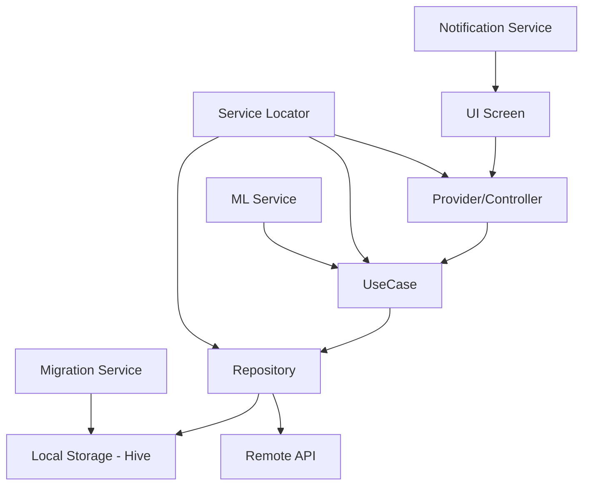

# 🚀 Guía Completa de Onboarding - TempoSage

## 📋 Tabla de Contenido
- [Introducción al Proyecto](#-introducción-al-proyecto)
- [Flutter y Dart para Desarrolladores Experimentados](#-flutter-y-dart-para-desarrolladores-experimentados)
- [Arquitectura del Proyecto](#️-arquitectura-del-proyecto)
- [Análisis Detallado por Secciones](#-análisis-detallado-por-secciones)
- [Patrones de Desarrollo](#-patrones-de-desarrollo)
- [Flujos de Trabajo](#-flujos-de-trabajo)
- [Debugging y Testing](#-debugging-y-testing)
- [Best Practices](#-best-practices)
- [Troubleshooting Común](#-troubleshooting-común)

---

## 🎯 Introducción al Proyecto

**TempoSage** es una aplicación móvil multiplataforma desarrollada en Flutter para la gestión inteligente de productividad personal. Combina planificación tradicional con inteligencia artificial para optimizar el tiempo del usuario.

### 🎯 Características Principales

- **Gestión de Actividades**: Creación, edición y seguimiento de tareas con recordatorios inteligentes
- **Bloques de Tiempo (TimeBlocks)**: Planificación visual del día mediante bloques temporales
- **Seguimiento de Hábitos**: Sistema de tracking de rutinas con estadísticas de progreso
- **Recomendaciones ML**: Sugerencias basadas en patrones de comportamiento del usuario
- **Integración de Calendario**: Sincronización con calendarios del dispositivo
- **Notificaciones Inteligentes**: Sistema de alertas contextual y no intrusivo
- **Interfaz Adaptable**: Soporte para modo claro/oscuro con temas Catppuccin

### 🏗️ Stack Tecnológico

| Categoría | Tecnología | Versión | Propósito |
|-----------|------------|---------|-----------|
| **Framework** | Flutter | >=3.2.3 | UI multiplataforma |
| **Lenguaje** | Dart | >=3.2.3 | Lógica de aplicación |
| **Estado** | Provider + Bloc | ^6.1.4 / ^8.1.4 | Gestión de estado |
| **BD Local** | Hive | ^2.2.3 | NoSQL embedded |
| **DI** | GetIt + Injectable | ^7.6.7 / ^2.5.0 | Inyección de dependencias |
| **ML** | TensorFlow Lite | ^0.11.0 | Recomendaciones |
| **UI** | Material 3 + Catppuccin | - | Sistema de diseño |
| **Testing** | Flutter Test + Mockito | - | Pruebas unitarias |

---

## 🔷 Flutter y Dart para Desarrolladores Experimentados

### Comparación de Paradigmas

#### **Dart vs C#**
Dart está fuertemente inspirado en C# y Java, por lo que la transición es natural:

```dart
// 🔷 DART - Sintaxis familiar para desarrolladores C#
class UsuarioService {
  final String _apiUrl;
  final HttpClient _httpClient;
  
  // Constructor con parámetros nombrados (similar a C# 9.0)
  UsuarioService({
    required String apiUrl,
    HttpClient? httpClient,
  }) : _apiUrl = apiUrl,
       _httpClient = httpClient ?? HttpClient();
  
  // Async/await idéntico a C#
  Future<Usuario?> obtenerUsuario(String id) async {
    try {
      final response = await _httpClient.get('$_apiUrl/users/$id');
      return Usuario.fromJson(response.data);
    } catch (e) {
      print('Error: $e');
      return null;
    }
  }
  
  // Property con getter/setter (como C#)
  String get apiUrl => _apiUrl;
  
  // Null safety (como C# 8.0+)
  Usuario? _usuarioActual;
  Usuario get usuarioActual => _usuarioActual!; // ! = force unwrap
}

// C# EQUIVALENTE
public class UsuarioService {
  private readonly string _apiUrl;
  private readonly HttpClient _httpClient;
  
  public UsuarioService(string apiUrl, HttpClient? httpClient = null) {
    _apiUrl = apiUrl;
    _httpClient = httpClient ?? new HttpClient();
  }
  
  public async Task<Usuario?> ObtenerUsuarioAsync(string id) {
    try {
      var response = await _httpClient.GetAsync($"{_apiUrl}/users/{id}");
      return await response.Content.ReadFromJsonAsync<Usuario>();
    } catch (Exception e) {
      Console.WriteLine($"Error: {e}");
      return null;
    }
  }
  
  public string ApiUrl => _apiUrl;
  
  private Usuario? _usuarioActual;
  public Usuario UsuarioActual => _usuarioActual!;
}
```

#### **Conceptos Únicos de Dart**

##### 1. **Named Parameters vs Positional**
```dart
// Parámetros posicionales (como siempre)
void crearUsuario(String nombre, int edad, String email) {}

// Parámetros nombrados (más legible)
void crearUsuario({
  required String nombre,    // Obligatorio
  required int edad,
  String? email,            // Opcional
  bool activo = true,       // Con valor por defecto
}) {}

// Uso más claro
crearUsuario(
  nombre: 'Juan',
  edad: 25,
  email: 'juan@email.com',
);
```

##### 2. **Null Safety Profundo**
```dart
// Declaración de nullability
String nombre;           // Error: debe inicializarse
String? apellido;        // OK: puede ser null
late String id;          // OK: se inicializará después

// Operadores null-aware
String texto = apellido ?? 'Sin apellido';    // Si null, usar default
apellido ??= 'Asignado';                      // Asignar solo si es null
int? longitud = apellido?.length;             // Safe navigation
String seguro = apellido!;                    // Force unwrap (peligroso)

// Pattern matching con null
switch (apellido) {
  case String value:
    print('Apellido: $value');
  case null:
    print('Sin apellido');
}
```

##### 3. **Mixins (Herencia Múltiple Controlada)**
```dart
// Mixin es como interface + implementación
mixin Loggeable {
  void log(String mensaje) {
    print('[${DateTime.now()}] $mensaje');
  }
}

mixin Validable {
  bool validar();
}

// Clase que usa múltiples mixins
class Usuario with Loggeable, Validable {
  String nombre;
  
  Usuario(this.nombre);
  
  @override
  bool validar() {
    log('Validando usuario: $nombre');
    return nombre.isNotEmpty;
  }
}

// En C# necesitarías interfaces + composición
```

##### 4. **Extension Methods (como C#)**
```dart
// Extender tipos existentes
extension StringExtensions on String {
  bool get esEmail => contains('@') && contains('.');
  
  String get capitalizado => 
    isEmpty ? this : this[0].toUpperCase() + substring(1);
}

// Uso
String email = 'test@gmail.com';
print(email.esEmail);        // true
print('hola'.capitalizado);  // 'Hola'
```

### Flutter vs Frameworks Web

#### **Widget System vs React/Vue**

```dart
// 🔷 FLUTTER - Todo es un Widget
class MiComponente extends StatelessWidget {
  final String titulo;
  final VoidCallback? onPressed;
  
  const MiComponente({
    super.key,
    required this.titulo,
    this.onPressed,
  });
  
  @override
  Widget build(BuildContext context) {
    return Container(
      padding: EdgeInsets.all(16),
      decoration: BoxDecoration(
        color: Colors.blue,
        borderRadius: BorderRadius.circular(8),
      ),
      child: Column(
        children: [
          Text(
            titulo,
            style: TextStyle(
              fontSize: 18,
              fontWeight: FontWeight.bold,
              color: Colors.white,
            ),
          ),
          if (onPressed != null) // Conditional rendering
            ElevatedButton(
              onPressed: onPressed,
              child: Text('Acción'),
            ),
        ],
      ),
    );
  }
}

// 🟢 REACT EQUIVALENTE
function MiComponente({ titulo, onPressed }) {
  return (
    <div style={{
      padding: '16px',
      backgroundColor: 'blue',
      borderRadius: '8px',
    }}>
      <h3 style={{
        fontSize: '18px',
        fontWeight: 'bold',
        color: 'white',
      }}>
        {titulo}
      </h3>
      {onPressed && (
        <button onClick={onPressed}>
          Acción
        </button>
      )}
    </div>
  );
}

// 🟡 VUE EQUIVALENTE
<template>
  <div class="mi-componente">
    <h3>{{ titulo }}</h3>
    <button v-if="onPressed" @click="onPressed">
      Acción
    </button>
  </div>
</template>

<script>
export default {
  props: {
    titulo: { type: String, required: true },
    onPressed: { type: Function, default: null }
  }
}
</script>
```

#### **State Management Comparison**

```dart
// 🔷 FLUTTER CON STATEFUL WIDGET
class ContadorWidget extends StatefulWidget {
  @override
  _ContadorWidgetState createState() => _ContadorWidgetState();
}

class _ContadorWidgetState extends State<ContadorWidget> {
  int _contador = 0;
  
  void _incrementar() {
    setState(() {  // Equivalent a setCount en React
      _contador++;
    });
  }
  
  @override
  Widget build(BuildContext context) {
    return Column(
      children: [
        Text('Contador: $_contador'),
        ElevatedButton(
          onPressed: _incrementar,
          child: Text('Incrementar'),
        ),
      ],
    );
  }
}

// 🟢 REACT CON HOOKS
function ContadorWidget() {
  const [contador, setContador] = useState(0);
  
  const incrementar = () => {
    setContador(contador + 1);
  };
  
  return (
    <div>
      <p>Contador: {contador}</p>
      <button onClick={incrementar}>
        Incrementar
      </button>
    </div>
  );
}

// 🔷 FLUTTER CON PROVIDER (Global State)
class ContadorProvider extends ChangeNotifier {
  int _contador = 0;
  
  int get contador => _contador;
  
  void incrementar() {
    _contador++;
    notifyListeners();  // Similar a dispatch en Redux
  }
}

// Widget consumidor
class ContadorDisplay extends StatelessWidget {
  @override
  Widget build(BuildContext context) {
    return Consumer<ContadorProvider>(
      builder: (context, provider, child) {
        return Text('Contador: ${provider.contador}');
      },
    );
  }
}
```

---

## 🏗️ Arquitectura del Proyecto

### Visión General

TempoSage sigue los principios de **Clean Architecture** adaptados para Flutter, con una estructura modular por features que facilita el mantenimiento y testing.

```
temposage/
├── 📱 lib/
│   ├── 🎯 main.dart                    # Entry point
│   ├── 🔧 core/                        # Shared functionality
│   │   ├── constants/                  # App constants
│   │   ├── database/                   # DB configuration
│   │   ├── di/                         # Dependency injection
│   │   ├── extensions/                 # Extension methods
│   │   ├── l10n/                       # Internationalization
│   │   ├── navigation/                 # Routing system
│   │   ├── services/                   # Global services
│   │   ├── theme/                      # Theme system
│   │   ├── utils/                      # Utilities
│   │   └── widgets/                    # Reusable widgets
│   ├── 🎨 features/                    # Feature modules
│   │   ├── activities/                 # Activity management
│   │   │   ├── data/
│   │   │   │   ├── models/            # Data models
│   │   │   │   └── repositories/      # Data access
│   │   │   ├── domain/
│   │   │   │   ├── entities/          # Business entities
│   │   │   │   ├── services/          # Business logic
│   │   │   │   └── usecases/          # Use cases
│   │   │   └── presentation/
│   │   │       ├── controllers/       # State management
│   │   │       ├── screens/           # UI screens
│   │   │       └── widgets/           # Feature widgets
│   │   ├── timeblocks/                # Time block management
│   │   ├── habits/                    # Habit tracking
│   │   ├── calendar/                  # Calendar integration
│   │   ├── dashboard/                 # Main dashboard
│   │   ├── settings/                  # App settings
│   │   └── auth/                      # Authentication
│   ├── 📊 data/                       # Global data layer
│   └── 🎪 presentation/               # Global UI layer
├── 📋 assets/                         # Static assets
│   ├── images/                        # Images
│   ├── fonts/                         # Custom fonts
│   ├── ml_models/                     # ML models
│   └── models/                        # Data models
├── 📄 docs/                          # Documentation
├── 🧪 test/                          # Test files
└── 📦 build/                         # Build outputs
```

### Flujo de Datos (Data Flow)



### Separación de Responsabilidades

#### **1. Data Layer (Persistencia)**
- **Models**: Representación de datos serializables
- **Repositories**: Abstracción de fuentes de datos
- **Local Storage**: Gestión de Hive database

#### **2. Domain Layer (Lógica de Negocio)**
- **Entities**: Objetos de negocio puros
- **Services**: Lógica de dominio compleja
- **UseCases**: Operaciones específicas de negocio

#### **3. Presentation Layer (UI)**
- **Screens**: Pantallas completas de la app
- **Widgets**: Componentes reutilizables de UI
- **Controllers**: Gestión de estado de UI

---

## 📋 Análisis Detallado por Secciones

### 1. 🎯 `main.dart` - Punto de Entrada

#### Responsabilidades Principales

```dart
void main() async {
  await _initializeApp();
}

Future<void> _initializeApp() async {
  // 1. Configuración de Flutter
  WidgetsFlutterBinding.ensureInitialized();
  
  // 2. Configuración de localización
  await initializeDateFormatting('es');
  
  // 3. Inicialización de almacenamiento
  await _initializeStorage();
  
  // 4. Configuración de servicios
  await _initializeServices();
  
  // 5. Migraciones de datos
  await MigrationService.runMigrations();
  
  // 6. Configuración de ML y tareas en segundo plano
  _setupBackgroundTasks();
  
  // 7. Verificación de autenticación
  final authState = await _checkAuthState();
  
  // 8. Inicialización de la app
  runApp(MyApp(initialAuthState: authState));
}
```

#### Patrón de Inicialización

**¿Por qué este patrón?**
- **Inicialización controlada**: Cada paso se ejecuta en orden específico
- **Gestión de errores**: Captura problemas durante el arranque
- **Estado limpio**: Garantiza que todos los servicios estén listos antes de mostrar UI

**Comparación con otros frameworks:**

```csharp
// C# ASP.NET Core equivalente
public static async Task Main(string[] args) {
    var builder = WebApplication.CreateBuilder(args);
    
    // Configurar servicios (DI)
    builder.Services.AddDbContext<AppDbContext>();
    builder.Services.AddScoped<IUserService, UserService>();
    
    var app = builder.Build();
    
    // Ejecutar migraciones
    using (var scope = app.Services.CreateScope()) {
        var dbContext = scope.ServiceProvider.GetRequiredService<AppDbContext>();
        await dbContext.Database.MigrateAsync();
    }
    
    // Configurar pipeline
    app.UseAuthentication();
    app.UseAuthorization();
    
    await app.RunAsync();
}
```

#### Gestión de Adaptadores Hive

```dart
void _safeRegisterAdapter<T>(int typeId, TypeAdapter<T> adapter, String name) {
  try {
    if (!Hive.isAdapterRegistered(typeId)) {
      Hive.registerAdapter<T>(adapter);
      _logger.d('Adaptador $name registrado con typeId $typeId');
    } else {
      _logger.d('Adaptador $name ya registrado');
    }
  } catch (e) {
    _logger.w('Error registrando $name: $e');
    // Solo re-lanzar si no es un error de "ya registrado"
    if (!e.toString().contains('already a TypeAdapter')) {
      rethrow;
    }
  }
}
```

**¿Qué hace este código?**
- **Registro seguro**: Evita errores si el adaptador ya existe
- **Logging detallado**: Facilita debugging de problemas de serialización
- **Graceful degradation**: No falla la app por adaptadores duplicados

### 2. 🔧 `core/services/` - Servicios Globales

#### ServiceLocator Pattern

```dart
class ServiceLocator {
  static final ServiceLocator instance = ServiceLocator._internal();
  
  // Singleton pattern (como en C#)
  ServiceLocator._internal() {
    _initRepositories();
  }
  
  // Lazy initialization (como Lazy<T> en C#)
  NotificationService? _notificationService;
  NotificationService get notificationService {
    _notificationService ??= NotificationService();
    return _notificationService!;
  }
  
  // Repository pattern
  late final ActivityRepository _activityRepository;
  ActivityRepository get activityRepository => _activityRepository;
}
```

**¿Por qué ServiceLocator en lugar de Constructor Injection?**

| Aspecto | ServiceLocator | Constructor Injection |
|---------|----------------|----------------------|
| **Simplicidad** | ✅ Fácil de usar | ❌ Requiere configuración compleja |
| **Testing** | ⚠️ Más difícil de mockear | ✅ Fácil de mockear |
| **Explicitez** | ❌ Dependencias ocultas | ✅ Dependencias explícitas |
| **Flutter Idiomatic** | ✅ Común en Flutter | ❌ Menos común |

**En TempoSage se eligió ServiceLocator porque:**
- Simplicidad para un equipo pequeño
- Menos boilerplate code
- Fácil acceso desde cualquier parte de la app

#### Migration Service - Sistema de Versioning

```dart
class MigrationService {
  static const String _lastMigrationKey = 'last_migration_version';
  static const int _currentMigrationVersion = 1;
  
  static Future<void> runMigrations() async {
    final prefs = await SharedPreferences.getInstance();
    final lastMigration = prefs.getInt(_lastMigrationKey) ?? 0;
    
    if (lastMigration < _currentMigrationVersion) {
      // Ejecutar migraciones en orden secuencial
      if (lastMigration < 1) {
        await _migrationV1CleanDuplicateTimeBlocks();
      }
      
      // Futuras migraciones aquí
      // if (lastMigration < 2) await _migrationV2...();
      
      // Actualizar versión
      await prefs.setInt(_lastMigrationKey, _currentMigrationVersion);
    }
  }
}
```

**¿Para qué sirve esto?**
- **Evolución de datos**: Permite cambios en estructura sin perder datos del usuario
- **Limpieza automática**: Elimina duplicados y corrige inconsistencias
- **Versionado**: Control preciso de qué migraciones se han ejecutado

**Ejemplo de migración real:**

```dart
static Future<void> _migrationV1CleanDuplicateTimeBlocks() async {
  try {
    // 1. Analizar el problema
    final stats = await DuplicateTimeBlockCleaner.analyzeDuplicates();
    
    if (stats['totalDuplicates'] > 0) {
      _logger.i('Encontrados ${stats['totalDuplicates']} duplicados');
      
      // 2. Ejecutar limpieza
      final removedCount = await DuplicateTimeBlockCleaner.cleanAllDuplicates();
      
      _logger.i('Eliminados $removedCount duplicados');
    }
  } catch (e) {
    _logger.e('Error en migración V1: $e');
    // No re-lanzar para no bloquear la app
  }
}
```

### 3. 🎨 `features/` - Arquitectura Modular

#### Estructura de Feature

Cada feature sigue la misma estructura para consistencia:

```
features/activities/
├── data/
│   ├── models/
│   │   ├── activity_model.dart         # Serializable data model
│   │   ├── activity_model.freezed.dart # Generated immutable methods
│   │   └── activity_model.g.dart       # Generated JSON serialization
│   └── repositories/
│       └── activity_repository.dart    # Data access layer
├── domain/
│   ├── entities/
│   │   └── activity.dart              # Pure business entity
│   ├── services/
│   │   └── activity_service.dart      # Business logic
│   └── usecases/
│       └── create_activity_usecase.dart # Specific operation
└── presentation/
    ├── screens/
    │   ├── activities_screen.dart     # List view
    │   └── create_activity_screen.dart # Create/edit form
    ├── widgets/
    │   ├── activity_card.dart         # Individual activity display
    │   └── activity_form.dart         # Form component
    └── controllers/
        └── activity_controller.dart   # State management
```

#### Modelo de Datos con Freezed

```dart
@freezed
abstract class ActivityModel with _$ActivityModel {
  const ActivityModel._(); // Constructor privado para métodos adicionales
  
  const factory ActivityModel({
    required String id,
    required String title,
    required String description,
    required String category,
    required DateTime startTime,
    required DateTime endTime,
    @Default('Media') String priority,
    @Default(true) bool sendReminder,
    @Default(15) int reminderMinutesBefore,
    @Default(false) bool isCompleted,
  }) = _ActivityModel;
  
  // Serialización automática
  factory ActivityModel.fromJson(Map<String, dynamic> json) =>
      _$ActivityModelFromJson(json);
  
  // Métodos de dominio (business logic)
  ActivityModel toggleCompletion() => copyWith(isCompleted: !isCompleted);
  
  bool get isOverdue => DateTime.now().isAfter(endTime);
  
  Duration get duration => endTime.difference(startTime);
  
  bool get isActive =>
      DateTime.now().isAfter(startTime) && DateTime.now().isBefore(endTime);
}
```

**Beneficios de Freezed:**
- **Inmutabilidad**: Los objetos no pueden modificarse después de creación
- **copyWith()**: Método automático para crear copias con cambios
- **Equality**: Comparación por valor automática
- **toString()**: Representación legible automática
- **JSON serialization**: Generación automática de serialización

**Comparación con C# Records:**

```csharp
// C# Record equivalente
public record ActivityModel(
    string Id,
    string Title,
    string Description,
    string Category,
    DateTime StartTime,
    DateTime EndTime,
    string Priority = "Media",
    bool SendReminder = true,
    int ReminderMinutesBefore = 15,
    bool IsCompleted = false
) {
    // Métodos de dominio
    public ActivityModel ToggleCompletion() => this with { IsCompleted = !IsCompleted };
    
    public bool IsOverdue => DateTime.Now > EndTime;
    
    public TimeSpan Duration => EndTime - StartTime;
    
    public bool IsActive => DateTime.Now > StartTime && DateTime.Now < EndTime;
}
```

#### Repository Pattern Implementation

```dart
class ActivityRepository {
  static const String _boxName = 'activities';
  final TimeBlockRepository _timeBlockRepository;
  final Logger _logger = Logger.instance;
  
  // Cache en memoria para performance
  final List<ActivityModel> _activities = [];
  
  ActivityRepository({required TimeBlockRepository timeBlockRepository})
      : _timeBlockRepository = timeBlockRepository;
  
  // CRUD operations
  Future<List<ActivityModel>> getAllActivities() async {
    try {
      return await LocalStorage.getAllData<ActivityModel>(_boxName);
    } catch (e) {
      throw ActivityRepositoryException('Error al obtener actividades: $e');
    }
  }
  
  Future<void> addActivity(ActivityModel activity) async {
    try {
      // 1. Actualizar cache
      _activities.add(activity);
      
      // 2. Persistir en BD
      await LocalStorage.saveData<ActivityModel>(_boxName, activity.id, activity);
      
      // 3. Sincronizar con otros dominios
      await _syncWithTimeBlock(activity);
      
      // 4. Efectos secundarios (notificaciones)
      if (activity.sendReminder) {
        await ServiceLocator.instance.activityNotificationService
            .scheduleActivityNotification(activity);
      }
      
      _logger.i('Actividad agregada: ${activity.title}');
    } catch (e) {
      _logger.e('Error agregando actividad: $e');
      rethrow;
    }
  }
  
  // Sincronización entre dominios
  Future<void> _syncWithTimeBlock(ActivityModel activity) async {
    // Crear o actualizar timeblock correspondiente
    final timeBlocks = await _timeBlockRepository.getTimeBlocksByDate(activity.startTime);
    
    // Buscar timeblock existente
    final existingBlock = timeBlocks.firstWhere(
      (block) => block.description.contains('[ACTIVITY_GENERATED]') &&
                 block.description.contains('ID: ${activity.id}'),
      orElse: () => null,
    );
    
    if (existingBlock != null) {
      // Actualizar existente
      final updatedBlock = existingBlock.copyWith(
        title: activity.title,
        startTime: activity.startTime,
        endTime: activity.endTime,
        isCompleted: activity.isCompleted,
      );
      await _timeBlockRepository.updateTimeBlock(updatedBlock);
    } else {
      // Crear nuevo
      final newBlock = TimeBlockModel(
        id: uuid.v4(),
        title: activity.title,
        description: '[ACTIVITY_GENERATED] ID: ${activity.id}',
        startTime: activity.startTime,
        endTime: activity.endTime,
        category: activity.category,
        isCompleted: activity.isCompleted,
      );
      await _timeBlockRepository.addTimeBlock(newBlock);
    }
  }
}
```

**Características del Repository:**
- **Single Source of Truth**: Un lugar para toda la lógica de datos
- **Cache Strategy**: Mantiene datos en memoria para performance
- **Cross-Domain Sync**: Sincroniza automáticamente con timeblocks
- **Side Effects**: Maneja notificaciones y otros efectos
- **Error Handling**: Excepciones específicas para diferentes errores

### 4. 🎨 `presentation/` - UI Layer

#### Widget Architecture

```dart
// Widget sin estado para componentes puros
class ActivityCard extends StatelessWidget {
  final ActivityModel activity;
  final VoidCallback? onTap;
  final VoidCallback? onEdit;
  final VoidCallback? onDelete;
  
  const ActivityCard({
    super.key,
    required this.activity,
    this.onTap,
    this.onEdit,
    this.onDelete,
  });
  
  @override
  Widget build(BuildContext context) {
    return AccessibleCard.elevated(
      onTap: onTap,
      child: Column(
        crossAxisAlignment: CrossAxisAlignment.start,
        children: [
          _buildHeader(context),
          SizedBox(height: 8),
          _buildContent(context),
          if (_hasActions) _buildActions(context),
        ],
      ),
    );
  }
  
  Widget _buildHeader(BuildContext context) {
    return Row(
      children: [
        Icon(
          activity.isCompleted ? Icons.check_circle : Icons.radio_button_unchecked,
          color: activity.isCompleted 
              ? Theme.of(context).colorScheme.primary
              : Theme.of(context).colorScheme.outline,
        ),
        SizedBox(width: 8),
        Expanded(
          child: Text(
            activity.title,
            style: Theme.of(context).textTheme.titleMedium?.copyWith(
              decoration: activity.isCompleted 
                  ? TextDecoration.lineThrough 
                  : null,
            ),
          ),
        ),
        _buildPriorityIndicator(context),
      ],
    );
  }
  
  // Más métodos helper...
}
```

#### Screen Structure

```dart
class ActivitiesScreen extends StatefulWidget {
  @override
  _ActivitiesScreenState createState() => _ActivitiesScreenState();
}

class _ActivitiesScreenState extends State<ActivitiesScreen> {
  late final ActivityRepository _repository;
  List<ActivityModel> _activities = [];
  bool _isLoading = true;
  String? _error;
  
  @override
  void initState() {
    super.initState();
    _repository = ServiceLocator.instance.activityRepository;
    _loadActivities();
  }
  
  Future<void> _loadActivities() async {
    try {
      setState(() {
        _isLoading = true;
        _error = null;
      });
      
      final activities = await _repository.getAllActivities();
      
      setState(() {
        _activities = activities;
        _isLoading = false;
      });
    } catch (e) {
      setState(() {
        _error = e.toString();
        _isLoading = false;
      });
    }
  }
  
  @override
  Widget build(BuildContext context) {
    return Scaffold(
      appBar: CustomAppBar.main(
        title: 'Actividades',
        actions: [
          IconButton(
            icon: Icon(Icons.add),
            onPressed: _navigateToCreateActivity,
          ),
        ],
      ),
      body: _buildBody(),
    );
  }
  
  Widget _buildBody() {
    if (_isLoading) {
      return Center(child: CircularProgressIndicator());
    }
    
    if (_error != null) {
      return _buildErrorState();
    }
    
    if (_activities.isEmpty) {
      return _buildEmptyState();
    }
    
    return _buildActivityList();
  }
  
  // Estado de error
  Widget _buildErrorState() {
    return Center(
      child: Column(
        mainAxisAlignment: MainAxisAlignment.center,
        children: [
          Icon(
            Icons.error_outline,
            size: 64,
            color: Theme.of(context).colorScheme.error,
          ),
          SizedBox(height: 16),
          Text(
            'Error al cargar actividades',
            style: Theme.of(context).textTheme.titleMedium,
          ),
          SizedBox(height: 8),
          Text(
            _error!,
            style: Theme.of(context).textTheme.bodyMedium,
            textAlign: TextAlign.center,
          ),
          SizedBox(height: 16),
          ElevatedButton(
            onPressed: _loadActivities,
            child: Text('Reintentar'),
          ),
        ],
      ),
    );
  }
  
  // Estado vacío
  Widget _buildEmptyState() {
    return Center(
      child: Column(
        mainAxisAlignment: MainAxisAlignment.center,
        children: [
          Icon(
            Icons.event_note,
            size: 64,
            color: Theme.of(context).colorScheme.outline,
          ),
          SizedBox(height: 16),
          Text(
            'No hay actividades',
            style: Theme.of(context).textTheme.titleMedium,
          ),
          SizedBox(height: 8),
          Text(
            'Crea tu primera actividad para comenzar',
            style: Theme.of(context).textTheme.bodyMedium,
          ),
          SizedBox(height: 16),
          ElevatedButton.icon(
            onPressed: _navigateToCreateActivity,
            icon: Icon(Icons.add),
            label: Text('Crear Actividad'),
          ),
        ],
      ),
    );
  }
  
  // Lista de actividades
  Widget _buildActivityList() {
    return RefreshIndicator(
      onRefresh: _loadActivities,
      child: ListView.builder(
        padding: EdgeInsets.all(16),
        itemCount: _activities.length,
        itemBuilder: (context, index) {
          final activity = _activities[index];
          return Padding(
            padding: EdgeInsets.only(bottom: 8),
            child: ActivityCard(
              activity: activity,
              onTap: () => _viewActivity(activity),
              onEdit: () => _editActivity(activity),
              onDelete: () => _deleteActivity(activity),
            ),
          );
        },
      ),
    );
  }
}
```

#### Estado de UI Pattern

**Estados típicos de cualquier pantalla:**
1. **Loading**: Cargando datos
2. **Error**: Error al cargar datos
3. **Empty**: Sin datos para mostrar
4. **Success**: Datos cargados correctamente

**Helper para manejo de estados:**

```dart
// Enum para estados de UI
enum UiState { loading, error, empty, success }

// Widget builder para diferentes estados
class StateBuilder<T> extends StatelessWidget {
  final Future<T> future;
  final Widget Function(T data) successBuilder;
  final Widget Function(String error)? errorBuilder;
  final Widget? loadingBuilder;
  final Widget? emptyBuilder;
  final bool Function(T data)? isEmpty;
  
  const StateBuilder({
    super.key,
    required this.future,
    required this.successBuilder,
    this.errorBuilder,
    this.loadingBuilder,
    this.emptyBuilder,
    this.isEmpty,
  });
  
  @override
  Widget build(BuildContext context) {
    return FutureBuilder<T>(
      future: future,
      builder: (context, snapshot) {
        if (snapshot.connectionState == ConnectionState.waiting) {
          return loadingBuilder ?? Center(child: CircularProgressIndicator());
        }
        
        if (snapshot.hasError) {
          return errorBuilder?.call(snapshot.error.toString()) ??
              Center(child: Text('Error: ${snapshot.error}'));
        }
        
        final data = snapshot.data;
        if (data != null && isEmpty?.call(data) == true) {
          return emptyBuilder ?? Center(child: Text('Sin datos'));
        }
        
        return successBuilder(data!);
      },
    );
  }
}

// Uso
StateBuilder<List<ActivityModel>>(
  future: _repository.getAllActivities(),
  successBuilder: (activities) => ListView.builder(...),
  emptyBuilder: EmptyActivitiesWidget(),
  isEmpty: (activities) => activities.isEmpty,
)
```

### 5. 🎨 Sistema de Temas

#### Catppuccin Theme Implementation

```dart
class AppColors {
  // Paleta Catppuccin Latte (modo claro)
  static const Color _latteRosewater = Color(0xffdc8a78);
  static const Color _latteFlamingo = Color(0xffdd7878);
  static const Color _lattePink = Color(0xffea76cb);
  static const Color _latteMauve = Color(0xff8839ef);
  static const Color _latteRed = Color(0xffd20f39);
  static const Color _latteMaroon = Color(0xffe64553);
  static const Color _lattePeach = Color(0xfffe640b);
  static const Color _latteYellow = Color(0xffdf8e1d);
  static const Color _latteGreen = Color(0xff40a02b);
  static const Color _latteTeal = Color(0xff179299);
  static const Color _latteSky = Color(0xff04a5e5);
  static const Color _latteSapphire = Color(0xff209fb5);
  static const Color _latteBlue = Color(0xff1e66f5);
  static const Color _latteLavender = Color(0xff7287fd);
  
  // Colores de texto y superficie
  static const Color _latteText = Color(0xff4c4f69);
  static const Color _latteSubtext1 = Color(0xff5c5f77);
  static const Color _latteSubtext0 = Color(0xff6c6f85);
  static const Color _latteOverlay2 = Color(0xff7c7f93);
  static const Color _latteOverlay1 = Color(0xff8c8fa1);
  static const Color _latteOverlay0 = Color(0xff9ca0b0);
  static const Color _latteSurface2 = Color(0xffacb0be);
  static const Color _latteSurface1 = Color(0xffbcc0cc);
  static const Color _latteSurface0 = Color(0xffccd0da);
  static const Color _latteBase = Color(0xffeff1f5);
  static const Color _latteMantle = Color(0xffe6e9ef);
  static const Color _latteCrust = Color(0xffdce0e8);
  
  // Paleta Catppuccin Mocha (modo oscuro)
  static const Color _mochaRosewater = Color(0xfff5e0dc);
  // ... (más colores)
  
  // Método para obtener color dinámicamente
  static Color getCatppuccinColor(
    BuildContext context, {
    required String colorName,
  }) {
    final isDarkMode = Theme.of(context).brightness == Brightness.dark;
    
    switch (colorName.toLowerCase()) {
      case 'blue':
        return isDarkMode ? _mochaBlue : _latteBlue;
      case 'green':
        return isDarkMode ? _mochaGreen : _latteGreen;
      case 'red':
        return isDarkMode ? _mochaRed : _latteRed;
      case 'peach':
        return isDarkMode ? _mochaPeach : _lattePeach;
      case 'mauve':
        return isDarkMode ? _mochaMauve : _latteMauve;
      default:
        return isDarkMode ? _mochaBlue : _latteBlue;
    }
  }
}

// Temas de la aplicación
class AppThemes {
  static ThemeData get lightTheme {
    return ThemeData(
      useMaterial3: true,
      brightness: Brightness.light,
      colorScheme: ColorScheme.fromSeed(
        seedColor: AppColors._latteBlue,
        brightness: Brightness.light,
      ),
      textTheme: _textTheme,
      cardTheme: CardTheme(
        elevation: 2,
        shape: RoundedRectangleBorder(
          borderRadius: BorderRadius.circular(16),
        ),
      ),
      elevatedButtonTheme: ElevatedButtonThemeData(
        style: ElevatedButton.styleFrom(
          shape: RoundedRectangleBorder(
            borderRadius: BorderRadius.circular(12),
          ),
          padding: EdgeInsets.symmetric(horizontal: 24, vertical: 12),
        ),
      ),
    );
  }
  
  static ThemeData get darkTheme {
    return ThemeData(
      useMaterial3: true,
      brightness: Brightness.dark,
      colorScheme: ColorScheme.fromSeed(
        seedColor: AppColors._mochaBlue,
        brightness: Brightness.dark,
      ),
      textTheme: _textTheme,
      // ... mismas configuraciones
    );
  }
  
  static const TextTheme _textTheme = TextTheme(
    headlineLarge: TextStyle(
      fontFamily: 'Noto Sans',
      fontSize: 26,
      fontWeight: FontWeight.w600,
    ),
    titleLarge: TextStyle(
      fontFamily: 'Noto Sans',
      fontSize: 24,
      fontWeight: FontWeight.w500,
    ),
    bodyLarge: TextStyle(
      fontFamily: 'Noto Sans',
      fontSize: 18,
      fontWeight: FontWeight.w400,
    ),
    bodyMedium: TextStyle(
      fontFamily: 'Noto Sans',
      fontSize: 14,
      fontWeight: FontWeight.w400,
    ),
  );
}
```

#### Widget Personalizado con Tema

```dart
class ThemedContainer extends StatelessWidget {
  final Widget child;
  final String colorName;
  final bool elevated;
  
  const ThemedContainer({
    super.key,
    required this.child,
    this.colorName = 'blue',
    this.elevated = false,
  });
  
  @override
  Widget build(BuildContext context) {
    final backgroundColor = AppColors.getCatppuccinColor(
      context,
      colorName: colorName,
    ).withOpacity(0.1);
    
    final borderColor = AppColors.getCatppuccinColor(
      context,
      colorName: colorName,
    ).withOpacity(0.3);
    
    return Container(
      padding: EdgeInsets.all(16),
      decoration: BoxDecoration(
        color: backgroundColor,
        border: Border.all(color: borderColor),
        borderRadius: BorderRadius.circular(12),
        boxShadow: elevated ? [
          BoxShadow(
            color: Colors.black.withOpacity(0.1),
            blurRadius: 8,
            offset: Offset(0, 2),
          ),
        ] : null,
      ),
      child: child,
    );
  }
}
```

---

## 🔧 Patrones de Desarrollo

### 1. Naming Conventions

#### Archivos y Directorios
```
✅ Correcto:
- user_model.dart
- activity_repository.dart
- home_screen.dart
- create_activity_screen.dart

❌ Incorrecto:
- UserModel.dart
- ActivityRepository.dart
- HomeScreen.dart
- CreateActivityScreen.dart
```

#### Clases y Variables
```dart
// ✅ Clases: PascalCase
class ActivityModel {}
class UserRepository {}
class HomeScreen {}

// ✅ Variables y métodos: camelCase
String userName = 'Juan';
bool isLoggedIn = false;
void createUser() {}
Future<User> getUser() async {}

// ✅ Constantes: UPPER_SNAKE_CASE
const String API_BASE_URL = 'https://api.example.com';
const int MAX_RETRY_ATTEMPTS = 3;

// ✅ Archivos y directorios: snake_case
activity_model.dart
user_repository.dart
create_activity_screen.dart
```

### 2. Error Handling Pattern

```dart
// Custom exception para cada dominio
class ActivityRepositoryException implements Exception {
  final String message;
  final String? code;
  final dynamic originalError;
  
  ActivityRepositoryException(
    this.message, {
    this.code,
    this.originalError,
  });
  
  @override
  String toString() => 'ActivityRepositoryException: $message';
}

// Manejo consistente de errores
class ActivityRepository {
  Future<List<ActivityModel>> getAllActivities() async {
    try {
      final data = await LocalStorage.getAllData<ActivityModel>(_boxName);
      return data;
    } on HiveError catch (e) {
      // Error específico de Hive
      throw ActivityRepositoryException(
        'Error de base de datos al obtener actividades',
        code: 'DB_ERROR',
        originalError: e,
      );
    } catch (e) {
      // Error genérico
      throw ActivityRepositoryException(
        'Error inesperado al obtener actividades: $e',
        code: 'UNKNOWN_ERROR',
        originalError: e,
      );
    }
  }
}

// En la UI
class ActivitiesScreen extends StatefulWidget {
  Future<void> _loadActivities() async {
    try {
      final activities = await _repository.getAllActivities();
      setState(() {
        _activities = activities;
        _error = null;
      });
    } on ActivityRepositoryException catch (e) {
      setState(() {
        _error = e.message;
      });
      
      // Log para debugging
      _logger.e('Error cargando actividades', error: e);
      
      // Mostrar snackbar al usuario
      if (mounted) {
        ScaffoldMessenger.of(context).showSnackBar(
          SnackBar(
            content: Text(e.message),
            backgroundColor: Theme.of(context).colorScheme.error,
          ),
        );
      }
    }
  }
}
```

### 3. Logging Pattern

```dart
// Logger centralizado
class Logger {
  static final Logger instance = Logger._internal();
  Logger._internal();
  
  // Niveles de log
  void d(String message, {String? tag, Object? error, StackTrace? stackTrace}) {
    _log('DEBUG', message, tag: tag, error: error, stackTrace: stackTrace);
  }
  
  void i(String message, {String? tag}) {
    _log('INFO', message, tag: tag);
  }
  
  void w(String message, {String? tag, Object? error}) {
    _log('WARNING', message, tag: tag, error: error);
  }
  
  void e(String message, {String? tag, Object? error, StackTrace? stackTrace}) {
    _log('ERROR', message, tag: tag, error: error, stackTrace: stackTrace);
  }
  
  void c(String message, {String? tag, Object? error, StackTrace? stackTrace}) {
    _log('CRITICAL', message, tag: tag, error: error, stackTrace: stackTrace);
  }
  
  void _log(
    String level,
    String message, {
    String? tag,
    Object? error,
    StackTrace? stackTrace,
  }) {
    final timestamp = DateTime.now().toIso8601String();
    final tagStr = tag != null ? '[$tag] ' : '';
    final errorStr = error != null ? ' - Error: $error' : '';
    
    debugPrint('$timestamp [$level] $tagStr$message$errorStr');
    
    if (stackTrace != null) {
      debugPrint('StackTrace: $stackTrace');
    }
  }
}

// Uso en repositorios
class ActivityRepository {
  final Logger _logger = Logger.instance;
  
  Future<void> addActivity(ActivityModel activity) async {
    _logger.i('Agregando actividad: ${activity.title}', tag: 'ActivityRepo');
    
    try {
      await LocalStorage.saveData(_boxName, activity.id, activity);
      _logger.i('Actividad guardada exitosamente', tag: 'ActivityRepo');
    } catch (e, stackTrace) {
      _logger.e(
        'Error guardando actividad',
        tag: 'ActivityRepo',
        error: e,
        stackTrace: stackTrace,
      );
      rethrow;
    }
  }
}
```

### 4. Validation Pattern

```dart
// Validator helper
class ValidationHelper {
  static String? validateRequired(String? value, String fieldName) {
    if (value == null || value.trim().isEmpty) {
      return '$fieldName es requerido';
    }
    return null;
  }
  
  static String? validateEmail(String? value) {
    if (value == null || value.isEmpty) {
      return 'Email es requerido';
    }
    
    final emailRegex = RegExp(r'^[\w-\.]+@([\w-]+\.)+[\w-]{2,4}$');
    if (!emailRegex.hasMatch(value)) {
      return 'Email no válido';
    }
    
    return null;
  }
  
  static String? validateMinLength(String? value, int minLength, String fieldName) {
    if (value == null || value.length < minLength) {
      return '$fieldName debe tener al menos $minLength caracteres';
    }
    return null;
  }
  
  static String? validateTimeRange(TimeOfDay? start, TimeOfDay? end) {
    if (start == null || end == null) {
      return 'Hora de inicio y fin son requeridas';
    }
    
    final startMinutes = start.hour * 60 + start.minute;
    final endMinutes = end.hour * 60 + end.minute;
    
    if (startMinutes >= endMinutes) {
      return 'La hora de fin debe ser posterior a la de inicio';
    }
    
    return null;
  }
}

// Form con validación
class CreateActivityScreen extends StatefulWidget {
  @override
  _CreateActivityScreenState createState() => _CreateActivityScreenState();
}

class _CreateActivityScreenState extends State<CreateActivityScreen> {
  final _formKey = GlobalKey<FormState>();
  final _titleController = TextEditingController();
  final _descriptionController = TextEditingController();
  
  String? _validateTitle(String? value) {
    // Múltiples validaciones
    String? requiredError = ValidationHelper.validateRequired(value, 'Título');
    if (requiredError != null) return requiredError;
    
    String? lengthError = ValidationHelper.validateMinLength(value, 3, 'Título');
    if (lengthError != null) return lengthError;
    
    return null;
  }
  
  @override
  Widget build(BuildContext context) {
    return Scaffold(
      appBar: AppBar(title: Text('Crear Actividad')),
      body: Form(
        key: _formKey,
        child: Padding(
          padding: EdgeInsets.all(16),
          child: Column(
            children: [
              TextFormField(
                controller: _titleController,
                decoration: InputDecoration(
                  labelText: 'Título *',
                  hintText: 'Ingresa el título de la actividad',
                ),
                validator: _validateTitle,
                textInputAction: TextInputAction.next,
              ),
              SizedBox(height: 16),
              TextFormField(
                controller: _descriptionController,
                decoration: InputDecoration(
                  labelText: 'Descripción',
                  hintText: 'Descripción opcional',
                ),
                maxLines: 3,
                textInputAction: TextInputAction.done,
              ),
              Spacer(),
              SizedBox(
                width: double.infinity,
                child: ElevatedButton(
                  onPressed: _submitForm,
                  child: Text('Crear Actividad'),
                ),
              ),
            ],
          ),
        ),
      ),
    );
  }
  
  void _submitForm() {
    if (_formKey.currentState!.validate()) {
      // Formulario válido, proceder a guardar
      _saveActivity();
    }
  }
}
```

### 5. State Management Pattern

```dart
// Provider para estado global
class ActivityProvider extends ChangeNotifier {
  final ActivityRepository _repository;
  
  List<ActivityModel> _activities = [];
  bool _isLoading = false;
  String? _error;
  
  ActivityProvider(this._repository);
  
  // Getters
  List<ActivityModel> get activities => List.unmodifiable(_activities);
  bool get isLoading => _isLoading;
  String? get error => _error;
  
  // Filtros computados
  List<ActivityModel> get completedActivities =>
      _activities.where((a) => a.isCompleted).toList();
      
  List<ActivityModel> get pendingActivities =>
      _activities.where((a) => !a.isCompleted).toList();
  
  // Actions
  Future<void> loadActivities() async {
    _setLoading(true);
    try {
      final activities = await _repository.getAllActivities();
      _activities = activities;
      _error = null;
    } catch (e) {
      _error = e.toString();
    } finally {
      _setLoading(false);
    }
  }
  
  Future<void> addActivity(ActivityModel activity) async {
    try {
      await _repository.addActivity(activity);
      _activities.add(activity);
      notifyListeners();
    } catch (e) {
      _error = e.toString();
      notifyListeners();
      rethrow;
    }
  }
  
  Future<void> toggleActivityCompletion(String activityId) async {
    final index = _activities.indexWhere((a) => a.id == activityId);
    if (index == -1) return;
    
    final activity = _activities[index];
    final updatedActivity = activity.toggleCompletion();
    
    try {
      await _repository.updateActivity(updatedActivity);
      _activities[index] = updatedActivity;
      notifyListeners();
    } catch (e) {
      _error = e.toString();
      notifyListeners();
    }
  }
  
  void _setLoading(bool loading) {
    _isLoading = loading;
    notifyListeners();
  }
}

// Consumer en UI
class ActivitiesScreen extends StatelessWidget {
  @override
  Widget build(BuildContext context) {
    return Consumer<ActivityProvider>(
      builder: (context, provider, child) {
        if (provider.isLoading) {
          return Center(child: CircularProgressIndicator());
        }
        
        if (provider.error != null) {
          return ErrorWidget(
            error: provider.error!,
            onRetry: provider.loadActivities,
          );
        }
        
        return ListView.builder(
          itemCount: provider.activities.length,
          itemBuilder: (context, index) {
            final activity = provider.activities[index];
            return ActivityCard(
              activity: activity,
              onToggleCompletion: () => 
                  provider.toggleActivityCompletion(activity.id),
            );
          },
        );
      },
    );
  }
}
```

---

## 🚀 Flujos de Trabajo

### 1. Desarrollo de Nueva Feature

#### Paso 1: Planificación
```markdown
1. Definir requirements
2. Diseñar modelo de datos
3. Identificar dependencias
4. Crear user stories
```

#### Paso 2: Implementación
```bash
# 1. Crear estructura de directorios
mkdir -p lib/features/nueva_feature/{data/{models,repositories},domain/{entities,services,usecases},presentation/{screens,widgets,controllers}}

# 2. Crear modelo de datos
touch lib/features/nueva_feature/data/models/nueva_feature_model.dart

# 3. Implementar repository
touch lib/features/nueva_feature/data/repositories/nueva_feature_repository.dart

# 4. Crear pantallas
touch lib/features/nueva_feature/presentation/screens/nueva_feature_screen.dart

# 5. Registrar en service locator
# Editar lib/core/services/service_locator.dart

# 6. Agregar rutas
# Editar lib/core/navigation/app_router.dart
```

#### Paso 3: Testing
```dart
// Test del modelo
void main() {
  group('NuevaFeatureModel', () {
    test('should create model from valid JSON', () {
      // Arrange
      final json = {'id': '1', 'name': 'Test'};
      
      // Act
      final model = NuevaFeatureModel.fromJson(json);
      
      // Assert
      expect(model.id, '1');
      expect(model.name, 'Test');
    });
  });
}

// Test del repository
void main() {
  group('NuevaFeatureRepository', () {
    late NuevaFeatureRepository repository;
    late MockLocalStorage mockStorage;
    
    setUp(() {
      mockStorage = MockLocalStorage();
      repository = NuevaFeatureRepository(storage: mockStorage);
    });
    
    test('should save model successfully', () async {
      // Arrange
      final model = NuevaFeatureModel(id: '1', name: 'Test');
      when(mockStorage.saveData(any, any, any)).thenAnswer((_) async {});
      
      // Act
      await repository.save(model);
      
      // Assert
      verify(mockStorage.saveData('nueva_feature', '1', model));
    });
  });
}
```

### 2. Modificación de Feature Existente

#### Agregar Campo a Modelo
```dart
// 1. Modificar el modelo
@freezed
class ActivityModel with _$ActivityModel {
  const factory ActivityModel({
    required String id,
    required String title,
    // ... campos existentes
    String? newField,  // ← Campo nuevo
  }) = _ActivityModel;
}

// 2. Regenerar código
flutter packages pub run build_runner build

// 3. Crear migración si es necesario
static Future<void> _migrationV2AddNewField() async {
  final activities = await LocalStorage.getAllData<ActivityModel>('activities');
  
  for (final activity in activities) {
    if (activity.newField == null) {
      final updated = activity.copyWith(newField: 'default_value');
      await LocalStorage.saveData('activities', activity.id, updated);
    }
  }
}

// 4. Actualizar versión de migración
static const int _currentMigrationVersion = 2;

// 5. Actualizar UI si es necesario
// Modificar widgets que muestren el modelo
```

#### Modificar Lógica de Repository
```dart
class ActivityRepository {
  // Método existente
  Future<void> addActivity(ActivityModel activity) async {
    // ... implementación existente
  }
  
  // Nuevo método
  Future<List<ActivityModel>> getActivitiesByCategory(String category) async {
    try {
      final allActivities = await getAllActivities();
      return allActivities.where((a) => a.category == category).toList();
    } catch (e) {
      throw ActivityRepositoryException('Error al filtrar por categoría: $e');
    }
  }
}
```

### 3. Debugging Workflow

#### Debug en VS Code
```json
// .vscode/launch.json
{
  "version": "0.2.0",
  "configurations": [
    {
      "name": "Debug Flutter App",
      "type": "dart",
      "request": "launch",
      "program": "lib/main.dart",
      "args": ["--debug"]
    },
    {
      "name": "Profile Flutter App",
      "type": "dart",
      "request": "launch",
      "program": "lib/main.dart",
      "flutterMode": "profile"
    }
  ]
}
```

#### Debug de Base de Datos
```dart
// Helper para debug de Hive
class HiveDebugHelper {
  static Future<void> printAllBoxes() async {
    final openBoxes = Hive.boxNames;
    print('📦 Cajas abiertas: $openBoxes');
    
    for (final boxName in openBoxes) {
      await printBoxContents(boxName);
    }
  }
  
  static Future<void> printBoxContents(String boxName) async {
    try {
      final box = await Hive.openBox(boxName);
      print('\n📋 Contenido de $boxName:');
      print('   Cantidad de elementos: ${box.length}');
      
      for (final key in box.keys) {
        final value = box.get(key);
        print('   $key: ${value.runtimeType} - $value');
      }
    } catch (e) {
      print('❌ Error accediendo a $boxName: $e');
    }
  }
  
  static Future<void> clearBox(String boxName) async {
    try {
      final box = await Hive.openBox(boxName);
      await box.clear();
      print('🗑️ Caja $boxName limpiada');
    } catch (e) {
      print('❌ Error limpiando $boxName: $e');
    }
  }
}

// Uso en debug
void debugDatabase() async {
  await HiveDebugHelper.printAllBoxes();
  
  // Limpiar datos de prueba
  await HiveDebugHelper.clearBox('activities');
}
```

#### Performance Profiling
```bash
# Ejecutar en modo profile
flutter run --profile

# Profile en dispositivo
flutter run --profile --trace-startup
```

---

## 🧪 Debugging y Testing

### Testing Strategy

#### Unit Tests
```dart
// test/unit/models/activity_model_test.dart
void main() {
  group('ActivityModel', () {
    test('should create model with required fields', () {
      final activity = ActivityModel(
        id: '1',
        title: 'Test Activity',
        description: 'Test Description',
        category: 'Work',
        startTime: DateTime(2024, 1, 1, 10, 0),
        endTime: DateTime(2024, 1, 1, 11, 0),
      );
      
      expect(activity.id, '1');
      expect(activity.title, 'Test Activity');
      expect(activity.isCompleted, false); // Default value
    });
    
    test('should toggle completion status', () {
      final activity = ActivityModel(
        id: '1',
        title: 'Test',
        description: 'Test',
        category: 'Work',
        startTime: DateTime(2024, 1, 1, 10, 0),
        endTime: DateTime(2024, 1, 1, 11, 0),
      );
      
      final completed = activity.toggleCompletion();
      
      expect(completed.isCompleted, true);
      expect(completed.id, activity.id); // Other fields unchanged
    });
    
    test('should detect overdue activities', () {
      final pastTime = DateTime.now().subtract(Duration(hours: 1));
      final activity = ActivityModel(
        id: '1',
        title: 'Test',
        description: 'Test',
        category: 'Work',
        startTime: pastTime.subtract(Duration(hours: 1)),
        endTime: pastTime,
      );
      
      expect(activity.isOverdue, true);
    });
  });
}
```

#### Repository Tests
```dart
// test/unit/repositories/activity_repository_test.dart
void main() {
  group('ActivityRepository', () {
    late ActivityRepository repository;
    late MockLocalStorage mockStorage;
    late MockTimeBlockRepository mockTimeBlockRepo;
    
    setUp(() {
      mockStorage = MockLocalStorage();
      mockTimeBlockRepo = MockTimeBlockRepository();
      repository = ActivityRepository(
        timeBlockRepository: mockTimeBlockRepo,
      );
      
      // Inject mock storage (this would require dependency injection)
      // repository.storage = mockStorage;
    });
    
    test('should add activity successfully', () async {
      // Arrange
      final activity = ActivityModel(
        id: '1',
        title: 'Test Activity',
        description: 'Test',
        category: 'Work',
        startTime: DateTime(2024, 1, 1, 10, 0),
        endTime: DateTime(2024, 1, 1, 11, 0),
      );
      
      when(mockStorage.saveData(any, any, any))
          .thenAnswer((_) async {});
      
      // Act
      await repository.addActivity(activity);
      
      // Assert
      verify(mockStorage.saveData('activities', '1', activity)).called(1);
    });
    
    test('should throw exception when storage fails', () async {
      // Arrange
      final activity = ActivityModel(/* ... */);
      when(mockStorage.saveData(any, any, any))
          .thenThrow(Exception('Storage error'));
      
      // Act & Assert
      expect(
        () => repository.addActivity(activity),
        throwsA(isA<ActivityRepositoryException>()),
      );
    });
  });
}
```

#### Widget Tests
```dart
// test/widget/activity_card_test.dart
void main() {
  group('ActivityCard', () {
    testWidgets('should display activity information', (tester) async {
      // Arrange
      final activity = ActivityModel(
        id: '1',
        title: 'Test Activity',
        description: 'Test Description',
        category: 'Work',
        startTime: DateTime(2024, 1, 1, 10, 0),
        endTime: DateTime(2024, 1, 1, 11, 0),
      );
      
      // Act
      await tester.pumpWidget(
        MaterialApp(
          home: Scaffold(
            body: ActivityCard(activity: activity),
          ),
        ),
      );
      
      // Assert
      expect(find.text('Test Activity'), findsOneWidget);
      expect(find.text('Test Description'), findsOneWidget);
      expect(find.byIcon(Icons.radio_button_unchecked), findsOneWidget);
    });
    
    testWidgets('should show completed state', (tester) async {
      // Arrange
      final completedActivity = ActivityModel(
        id: '1',
        title: 'Completed Task',
        description: 'Done',
        category: 'Work',
        startTime: DateTime(2024, 1, 1, 10, 0),
        endTime: DateTime(2024, 1, 1, 11, 0),
        isCompleted: true,
      );
      
      // Act
      await tester.pumpWidget(
        MaterialApp(
          home: Scaffold(
            body: ActivityCard(activity: completedActivity),
          ),
        ),
      );
      
      // Assert
      expect(find.byIcon(Icons.check_circle), findsOneWidget);
    });
    
    testWidgets('should call onTap when tapped', (tester) async {
      // Arrange
      bool wasTapped = false;
      final activity = ActivityModel(/* ... */);
      
      // Act
      await tester.pumpWidget(
        MaterialApp(
          home: Scaffold(
            body: ActivityCard(
              activity: activity,
              onTap: () => wasTapped = true,
            ),
          ),
        ),
      );
      
      await tester.tap(find.byType(ActivityCard));
      
      // Assert
      expect(wasTapped, true);
    });
  });
}
```

#### Integration Tests
```dart
// integration_test/app_test.dart
void main() {
  group('Activity Flow Integration', () {
    testWidgets('should create and display activity', (tester) async {
      // Arrange
      app.main();
      await tester.pumpAndSettle();
      
      // Navigate to create activity
      await tester.tap(find.byIcon(Icons.add));
      await tester.pumpAndSettle();
      
      // Fill form
      await tester.enterText(
        find.byKey(Key('title_field')), 
        'Integration Test Activity'
      );
      await tester.enterText(
        find.byKey(Key('description_field')), 
        'Created by integration test'
      );
      
      // Save
      await tester.tap(find.text('Guardar'));
      await tester.pumpAndSettle();
      
      // Verify activity appears in list
      expect(find.text('Integration Test Activity'), findsOneWidget);
    });
  });
}
```

### Debugging Tools

#### Flutter Inspector
```bash
# Abrir Flutter Inspector
flutter run --debug
# Luego presionar 'i' en la terminal
```

#### Debug Console Output
```dart
// Diferentes niveles de debug
debugPrint('Información de debug');                    // Solo en debug mode
print('Información siempre visible');                  // Siempre visible
developer.log('Log estructurado', name: 'MyApp');      // Log avanzado

// Debug condicional
assert(() {
  print('Esto solo se ejecuta en debug mode');
  return true;
}());

// Debug de widgets
class DebugWidget extends StatelessWidget {
  @override
  Widget build(BuildContext context) {
    return Builder(
      builder: (context) {
        debugPrint('DebugWidget build() llamado');
        return Container(child: Text('Debug'));
      },
    );
  }
}
```

#### Performance Debugging
```dart
// Medir performance de widgets
class PerformanceWidget extends StatelessWidget {
  @override
  Widget build(BuildContext context) {
    return LayoutBuilder(
      builder: (context, constraints) {
        final stopwatch = Stopwatch()..start();
        
        final widget = ExpensiveWidget();
        
        stopwatch.stop();
        debugPrint('ExpensiveWidget build time: ${stopwatch.elapsedMilliseconds}ms');
        
        return widget;
      },
    );
  }
}

// Profile memory usage
void profileMemory() {
  developer.Timeline.startSync('MemoryProfile');
  
  // Operación a profiler
  final activities = List.generate(1000, (i) => ActivityModel(/*...*/));
  
  developer.Timeline.finishSync();
}
```

---

## 🎯 Best Practices

### 1. Widget Best Practices

#### Preferir StatelessWidget
```dart
// ✅ Bueno: StatelessWidget para UI puro
class ActivityTitle extends StatelessWidget {
  final String title;
  final bool isCompleted;
  
  const ActivityTitle({
    super.key,
    required this.title,
    required this.isCompleted,
  });
  
  @override
  Widget build(BuildContext context) {
    return Text(
      title,
      style: TextStyle(
        decoration: isCompleted ? TextDecoration.lineThrough : null,
      ),
    );
  }
}

// ❌ Malo: StatefulWidget innecesario
class ActivityTitle extends StatefulWidget {
  final String title;
  final bool isCompleted;
  
  @override
  _ActivityTitleState createState() => _ActivityTitleState();
}

class _ActivityTitleState extends State<ActivityTitle> {
  @override
  Widget build(BuildContext context) {
    return Text(
      widget.title,
      style: TextStyle(
        decoration: widget.isCompleted ? TextDecoration.lineThrough : null,
      ),
    );
  }
}
```

#### Usar const constructors
```dart
// ✅ Bueno: const constructor para widgets inmutables
class LoadingIndicator extends StatelessWidget {
  const LoadingIndicator({super.key});
  
  @override
  Widget build(BuildContext context) {
    return const Center(
      child: CircularProgressIndicator(),
    );
  }
}

// ✅ Uso con const
const LoadingIndicator()  // Evita recrear widget
```

#### Extraer widgets complejos
```dart
// ❌ Malo: build() muy complejo
class ActivityScreen extends StatelessWidget {
  @override
  Widget build(BuildContext context) {
    return Scaffold(
      appBar: AppBar(
        title: Text('Actividades'),
        actions: [
          IconButton(
            icon: Icon(Icons.search),
            onPressed: () {},
          ),
          PopupMenuButton(
            itemBuilder: (context) => [
              PopupMenuItem(child: Text('Filtrar')),
              PopupMenuItem(child: Text('Ordenar')),
            ],
          ),
        ],
      ),
      body: Column(
        children: [
          Container(
            padding: EdgeInsets.all(16),
            child: Row(
              children: [
                Expanded(
                  child: TextField(
                    decoration: InputDecoration(
                      hintText: 'Buscar actividades...',
                      prefixIcon: Icon(Icons.search),
                    ),
                  ),
                ),
                SizedBox(width: 8),
                FilterChip(
                  label: Text('Pendientes'),
                  selected: true,
                  onSelected: (selected) {},
                ),
              ],
            ),
          ),
          // ... más widgets complejos
        ],
      ),
    );
  }
}

// ✅ Bueno: widgets extraídos
class ActivityScreen extends StatelessWidget {
  @override
  Widget build(BuildContext context) {
    return Scaffold(
      appBar: _buildAppBar(),
      body: Column(
        children: [
          _SearchSection(),
          _FilterSection(),
          Expanded(child: _ActivityList()),
        ],
      ),
    );
  }
  
  AppBar _buildAppBar() {
    return AppBar(
      title: Text('Actividades'),
      actions: [
        _SearchButton(),
        _MenuButton(),
      ],
    );
  }
}

class _SearchSection extends StatelessWidget {
  const _SearchSection();
  
  @override
  Widget build(BuildContext context) {
    return Container(
      padding: EdgeInsets.all(16),
      child: TextField(
        decoration: InputDecoration(
          hintText: 'Buscar actividades...',
          prefixIcon: Icon(Icons.search),
        ),
      ),
    );
  }
}
```

### 2. State Management Best Practices

#### Minimizar rebuilds
```dart
// ✅ Bueno: Consumer específico
class ActivityList extends StatelessWidget {
  @override
  Widget build(BuildContext context) {
    return Consumer<ActivityProvider>(
      builder: (context, provider, child) {
        return ListView.builder(
          itemCount: provider.activities.length,
          itemBuilder: (context, index) {
            return ActivityCard(
              activity: provider.activities[index],
            );
          },
        );
      },
    );
  }
}

// ❌ Malo: Consumer muy amplio
class HomePage extends StatelessWidget {
  @override
  Widget build(BuildContext context) {
    return Consumer<ActivityProvider>(  // Reconstruye todo
      builder: (context, provider, child) {
        return Scaffold(
          appBar: AppBar(title: Text('Home')),
          body: Column(
            children: [
              SomeOtherWidget(),  // Se reconstruye innecesariamente
              ActivityList(),
              AnotherWidget(),    // Se reconstruye innecesariamente
            ],
          ),
        );
      },
    );
  }
}
```

#### Selector para optimización
```dart
// ✅ Muy bueno: Selector para propiedades específicas
class ActivityCountDisplay extends StatelessWidget {
  @override
  Widget build(BuildContext context) {
    return Selector<ActivityProvider, int>(
      selector: (context, provider) => provider.activities.length,
      builder: (context, count, child) {
        return Text('Total: $count actividades');
      },
    );
  }
}
```

### 3. Performance Best Practices

#### ListView optimization
```dart
// ✅ Bueno: ListView.builder para listas grandes
ListView.builder(
  itemCount: activities.length,
  itemBuilder: (context, index) {
    return ActivityCard(activity: activities[index]);
  },
)

// ❌ Malo: Column con scroll para listas grandes
SingleChildScrollView(
  child: Column(
    children: activities.map((activity) => 
      ActivityCard(activity: activity)
    ).toList(),
  ),
)

// ✅ Muy bueno: ListView.separated para separadores
ListView.separated(
  itemCount: activities.length,
  separatorBuilder: (context, index) => Divider(),
  itemBuilder: (context, index) {
    return ActivityCard(activity: activities[index]);
  },
)
```

#### Image optimization
```dart
// ✅ Bueno: Image.asset con cache
Image.asset(
  'assets/images/logo.png',
  cacheWidth: 200,  // Redimensionar para ahorrar memoria
  cacheHeight: 200,
)

// ✅ Bueno: FadeInImage para carga progresiva
FadeInImage.assetNetwork(
  placeholder: 'assets/images/placeholder.png',
  image: 'https://example.com/image.jpg',
)
```

#### Animation optimization
```dart
// ✅ Bueno: AnimationController con dispose
class AnimatedWidget extends StatefulWidget {
  @override
  _AnimatedWidgetState createState() => _AnimatedWidgetState();
}

class _AnimatedWidgetState extends State<AnimatedWidget>
    with SingleTickerProviderStateMixin {
  late AnimationController _controller;
  
  @override
  void initState() {
    super.initState();
    _controller = AnimationController(
      duration: Duration(milliseconds: 300),
      vsync: this,
    );
  }
  
  @override
  void dispose() {
    _controller.dispose();  // ⚠️ Importante: liberar recursos
    super.dispose();
  }
  
  @override
  Widget build(BuildContext context) {
    return AnimatedBuilder(
      animation: _controller,
      builder: (context, child) {
        return Transform.scale(
          scale: _controller.value,
          child: child,
        );
      },
      child: Container(  // ✅ Child inmutable para optimization
        width: 100,
        height: 100,
        color: Colors.blue,
      ),
    );
  }
}
```

### 4. Code Organization Best Practices

#### File structure
```
// ✅ Buena organización
lib/
├── features/
│   └── activities/
│       ├── data/
│       │   ├── models/
│       │   │   ├── activity_model.dart
│       │   │   └── activity_model.freezed.dart
│       │   └── repositories/
│       │       └── activity_repository.dart
│       └── presentation/
│           ├── screens/
│           │   ├── activities_screen.dart
│           │   └── create_activity_screen.dart
│           └── widgets/
│               ├── activity_card.dart
│               └── activity_form.dart

// ❌ Mala organización
lib/
├── screens/
│   ├── activity_screen.dart
│   ├── habit_screen.dart
│   └── settings_screen.dart
├── models/
│   ├── activity.dart
│   ├── habit.dart
│   └── settings.dart
└── widgets/
    ├── activity_card.dart
    ├── habit_card.dart
    └── settings_item.dart
```

#### Import organization
```dart
// ✅ Buena organización de imports
// 1. Dart imports
import 'dart:async';
import 'dart:convert';

// 2. Flutter imports  
import 'package:flutter/material.dart';
import 'package:flutter/services.dart';

// 3. Package imports (alfabético)
import 'package:hive/hive.dart';
import 'package:provider/provider.dart';

// 4. Local imports (alfabético)
import '../models/activity_model.dart';
import '../repositories/activity_repository.dart';
import '../widgets/activity_card.dart';

// ❌ Mala organización
import '../widgets/activity_card.dart';
import 'package:flutter/material.dart';
import '../models/activity_model.dart';
import 'package:hive/hive.dart';
import 'dart:async';
```

---

## ⚠️ Troubleshooting Común

### 1. Problemas de Build

#### Error: "Target of URI doesn't exist"
```bash
# Problema: Archivos generados faltantes
# Solución:
flutter clean
flutter pub get
flutter packages pub run build_runner build --delete-conflicting-outputs
```

#### Error: "Version solving failed"
```yaml
# Problema: Conflictos de versiones en pubspec.yaml
# Solución: Verificar compatibilidad
dependency_overrides:
  image: ^4.0.15  # Forzar versión específica
```

#### Error: "No registered adapter"
```dart
// Problema: Adaptador Hive no registrado
// Solución: Verificar registro en main.dart
void _safeRegisterAdapter<T>(int typeId, TypeAdapter<T> adapter, String name) {
  if (!Hive.isAdapterRegistered(typeId)) {
    Hive.registerAdapter<T>(adapter);
  }
}
```

### 2. Problemas de Estado

#### Widget no se actualiza
```dart
// Problema: setState() no llamado
// ❌ Malo
void updateCounter() {
  _counter++;  // Widget no se actualiza
}

// ✅ Bueno
void updateCounter() {
  setState(() {
    _counter++;
  });
}

// Problema: Provider no notifica
// ❌ Malo
void addItem(String item) {
  _items.add(item);  // Consumer no se actualiza
}

// ✅ Bueno
void addItem(String item) {
  _items.add(item);
  notifyListeners();
}
```

#### Memory leaks
```dart
// Problema: Listeners no removidos
// ❌ Malo
class _MyWidgetState extends State<MyWidget> {
  @override
  void initState() {
    super.initState();
    someStream.listen((data) {
      // Process data
    });
  }
}

// ✅ Bueno
class _MyWidgetState extends State<MyWidget> {
  StreamSubscription? _subscription;
  
  @override
  void initState() {
    super.initState();
    _subscription = someStream.listen((data) {
      // Process data
    });
  }
  
  @override
  void dispose() {
    _subscription?.cancel();
    super.dispose();
  }
}
```

### 3. Problemas de Datos

#### Datos no persisten
```dart
// Problema: Box de Hive no inicializado
// Solución: Verificar inicialización
Future<void> initializeHive() async {
  await Hive.initFlutter();
  
  // Registrar adaptadores ANTES de abrir boxes
  Hive.registerAdapter(ActivityModelAdapter());
  
  // Abrir box después del registro
  await Hive.openBox<ActivityModel>('activities');
}
```

#### Serialización falla
```dart
// Problema: Campos no serializables
// ❌ Malo
@freezed
class ActivityModel with _$ActivityModel {
  const factory ActivityModel({
    required String id,
    required DateTime startTime,
    Function? callback,  // No serializable
  }) = _ActivityModel;
}

// ✅ Bueno
@freezed
class ActivityModel with _$ActivityModel {
  const factory ActivityModel({
    required String id,
    required DateTime startTime,
    // Usar campos serializables únicamente
  }) = _ActivityModel;
}
```

### 4. Problemas de UI

#### Overflow errors
```dart
// Problema: Texto muy largo
// ❌ Malo
Text('Este es un texto muy largo que causará overflow')

// ✅ Bueno
Expanded(
  child: Text(
    'Este es un texto muy largo que se ajustará',
    overflow: TextOverflow.ellipsis,
  ),
)

// ✅ También bueno
Flexible(
  child: Text(
    'Este texto se ajustará automáticamente',
    maxLines: 2,
    overflow: TextOverflow.ellipsis,
  ),
)
```

#### Keyboard overflow
```dart
// Problema: Teclado cubre campos de entrada
// ✅ Solución: SingleChildScrollView
Scaffold(
  resizeToAvoidBottomInset: true,  // Importante
  body: SingleChildScrollView(
    padding: EdgeInsets.only(
      bottom: MediaQuery.of(context).viewInsets.bottom,
    ),
    child: Form(
      child: Column(
        children: [
          // Campos del formulario
        ],
      ),
    ),
  ),
)
```

### 5. Comandos de Diagnóstico

#### Verificar estado de Flutter
```bash
# Verificar instalación
flutter doctor -v

# Verificar dependencias
flutter pub deps

# Analizar código
flutter analyze

# Verificar tests
flutter test

# Limpiar build
flutter clean
```

#### Debug de base de datos
```dart
// Inspeccionar contenido de Hive
void debugHiveBoxes() async {
  print('Cajas disponibles: ${Hive.boxNames}');
  
  final activitiesBox = await Hive.openBox('activities');
  print('Actividades: ${activitiesBox.length}');
  
  for (var key in activitiesBox.keys) {
    final value = activitiesBox.get(key);
    print('   $key: ${value.runtimeType} - $value');
  }
}
```

#### Profile de performance
```bash
# Ejecutar en modo profile
flutter run --profile

# Profile en dispositivo
flutter run --profile --trace-startup
```

---

## 📚 Recursos Adicionales

### Documentación Oficial
- [Flutter Documentation](https://docs.flutter.dev/)
- [Dart Language Guide](https://dart.dev/guides)
- [Material Design 3](https://m3.material.io/)

### Packages Importantes del Proyecto
- [Hive Documentation](https://docs.hivedb.dev/)
- [Provider Documentation](https://pub.dev/packages/provider)
- [Freezed Documentation](https://pub.dev/packages/freezed)
- [GetIt Documentation](https://pub.dev/packages/get_it)

### Tools y Extensiones
- **VS Code Extensions**:
  - Flutter
  - Dart
  - Bracket Pair Colorizer
  - Flutter Tree
- **Android Studio Plugins**:
  - Flutter Plugin
  - Dart Plugin

### Comunidad
- [Flutter Discord](https://discord.gg/flutter)
- [Flutter Reddit](https://reddit.com/r/flutter)
- [Stack Overflow - Flutter](https://stackoverflow.com/questions/tagged/flutter)

---

¡Esta guía debería darte una base sólida para trabajar con el proyecto TempoSage! 🚀 